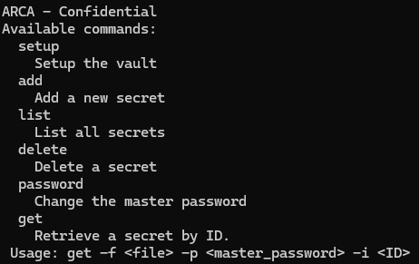
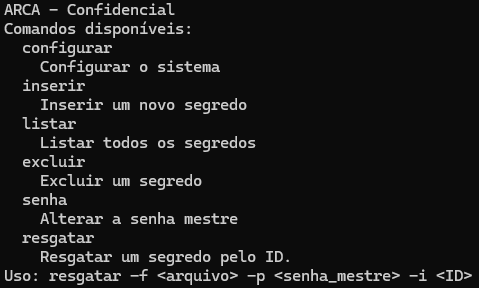
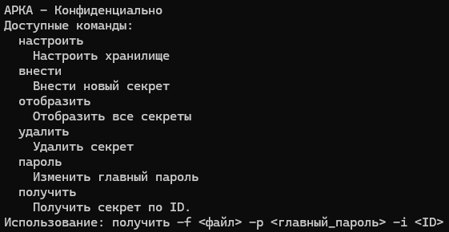

# ARCA - Vault for Passwords and Secrets

## ENGLISH

### Overview

ARCA is a robust encryption tool designed for extreme portability and security. With zero external dependencies, it minimizes the risk of supply chain attacks. The project implements **AES-GCM-SIV** using **Scrypt**, adhering to military-grade standards in line with FIPS.

### Features

- **Security**: Implements AES-GCM-SIV with Scrypt, designed for secure local storage of secrets, credentials, and passwords.
- **Polyglot Binaries**: Programs compiled using cosmocc produce a single binary capable of running seamlessly across all supported systems, without needing recompilation or system-specific adjustments.
- **Cross-Platform Support**: Runs natively on:
  - Linux
  - Mac
  - Windows
  - FreeBSD
  - OpenBSD
  - NetBSD
  - AMD64 and ARM64 architectures
- **Portability**: Designed to be carried on a USB drive for seamless operation across operating systems.
- **Language Support**: Documentation and usage available in English, Portuguese (Brazil), and Russian.

### Pending Feature

- User-defined Authenticated Data for AEAD tag customization.

---

# ARCA - Cofre de Segredos ou Credenciais

## PORTUGUÊS (Brasil)

### Visão Geral

ARCA é uma ferramenta robusta de criptografia projetada para extrema portabilidade e segurança. Sem dependências externas, minimiza o risco de ataques de "supply chain attack". O projeto implementa **AES-GCM-SIV** com **Scrypt**, aderindo aos padrões de nível militar em conformidade com o FIPS.

### Recursos

- **Segurança**: Implementa AES-GCM-SIV com Scrypt, projetado para armazenamento seguro de segredos, credenciais e senhas.
- **Binários Poliglotas**: Programas compilados usando cosmocc produzem um único binário capaz de rodar perfeitamente em todos os sistemas suportados, sem necessidade de recompilação ou ajustes específicos ao sistema.
- **Suporte Multiplataforma**: Executa nativamente em:
  - Linux
  - Mac
  - Windows
  - FreeBSD
  - OpenBSD
  - NetBSD
  - Arquiteturas AMD64 e ARM64
- **Portabilidade**: Projetado para ser transportado em um pendrive para operação contínua entre sistemas operacionais.
- **Suporte de Idiomas**: Documentação e uso disponíveis em inglês, português (Brasil) e russo.

### Recurso Pendente

- Definição de Dados Autenticados pelo usuário para personalização da tag AEAD.

---

# АРКА - Хранилище паролей и секретов

## RUSSIAN

### Общий обзор

ARCA — это мощный инструмент шифрования, разработанный для обеспечения исключительной портативности и безопасности. Без внешних зависимостей он минимизирует риск атак на цепочку поставок. Проект реализует **AES-GCM-SIV** с использованием **Scrypt**, соответствующий стандартам военного уровня в соответствии с FIPS.

### Возможности

- **Безопасность**: Реализует AES-GCM-SIV с Scrypt для безопасного локального хранения секретов, учетных данных и паролей.
- **Полиглотные Бинарные Файлы**: Программы, скомпилированные с использованием cosmocc, создают один бинарный файл, который может работать на всех поддерживаемых системах без необходимости перекомпиляции или специальных настроек.
- **Кроссплатформенность**: Работает нативно на:
  - Linux
  - Mac
  - Windows
  - FreeBSD
  - OpenBSD
  - NetBSD
  - архитектурах AMD64 и ARM64
- **Портативность**: Разработан для работы с USB-накопителя, обеспечивая беспроблемную работу на разных операционных системах.
- **Поддержка Языков**: Документация и использование доступны на английском, португальском (Бразилия) и русском языках.

### Ожидаемая функция

- Пользовательские аутентифицированные данные для настройки метки AEAD.

---
